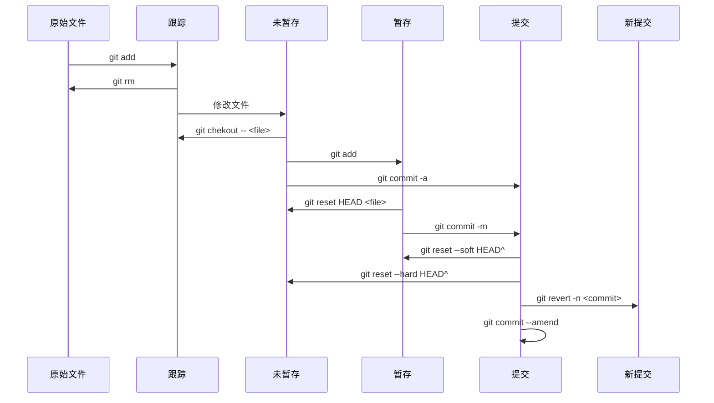

# Git-handbook

## Git 常用操作

### 文件状态管理



- 检查当前文件状态
	- `git status`
	- `git status -s`：简短版
- 撤销文件修改
	- `git checkout .`
	- `git checkout -- <file>`：撤销单文件修改
- 跟踪新文件：`git add <file>`
- 移除跟踪文件
	- `git rm <file>`：从磁盘移除，并从暂存区移除
	- `git rm --cache <file>`：保留在磁盘，但从暂存区移除
- 暂存已修改文件：`git add <file>`
- 取消暂存文件：`git reset HEAD <file>`
- 提交更新
	- `git commit`：启用默认文本编辑器写 message 提交
	- `git commit -m`：写一段 message 提交
	- `git commit -a`：跳过 `git add` 直接提交
- 撤销提交
	- `git commit -amend`：漏掉了几个文件没有添加，或者提交信息写错了。重新进行提交。
	- `git reset --soft|--hard <commit>`：重置当前 HEAD 到指定的状态，`--hard` 不保留指定状态之后的状态，谨慎使用（通过 `relog` 知道 hash id 能恢复）。
	- `git revert -n <commit>`：复制对应的 commit 状态，形成新的 commit，不影响其他 commit
- 撤销合并
	- `git merge --abort`

### 文件状态查看

- 查看修改
	- `git diff`：查看修改和暂存的比较
	- `git diff --cached|--staged`：查看已暂存和最后一次提交的比较
	- `git diff <brach> --stat`：以文件列表的方式查看当前分支与其他分支的比较
- 查看文件提交历史
	- `git log`
	- `git log -p -2`：显示每次提交引入的差异，`-2` 指最近两次提交
	- `git log --pretty=oneline`：一行简略版
	- `git log --pretty=format:"%h %s" --graph`：按特定格式打印
- 提交历史记录过滤
	- `git log --since="2018-10-01"`
	- `git log --author=gitster
	- `git log --grep="test"`

[`git log --pretty=format` 常用的选项](https://git-scm.com/book/zh/v2/ch00/rpretty_format) 列出了常用的格式占位符写法及其代表的意义。

| 选项  | 说明                                        |
| :---- | :------------------------------------------ |
| `%H`  | 提交的完整哈希值                            |
| `%h`  | 提交的简写哈希值                            |
| `%T`  | 树的完整哈希值                              |
| `%t`  | 树的简写哈希值                              |
| `%P`  | 父提交的完整哈希值                          |
| `%p`  | 父提交的简写哈希值                          |
| `%an` | 作者名字                                    |
| `%ae` | 作者的电子邮件地址                          |
| `%ad` | 作者修订日期（可以用 --date= 选项定制格式） |
| `%ar` | 作者修订日期，按多久以前的方式显示          |
| `%cn` | 提交者（committer）的名字                   |
| `%ce` | 提交者的电子邮件地址                        |
| `%cd` | 提交日期                                    |
| `%cr` | 提交日期（距今多长时间）                    |
| `%s`  | 提交说明                                    |

### 分支

- 创建分支：`git checkout -b <branch>`
- 删除分支：`git branch -d <brach>`
- 查看分支：`git brach -v|--merged|--no-merged`
- 切换分支：`git checkout <branch>`
- 合并分支：`git merge <brach>`
- 变基合并分支：`git rebase <brach>`
- 取消合并：`git reset --soft|--hard <commit>`

### 远程仓库

- 查看远程仓库：
	- `git remote -v`：列出远程 仓库
	- `git remote show [remote-name]` ：显示该远程仓库更多信息
- 添加远程仓库： `git remote add <symbol> <url>` 添加一个新的远程 Git 仓库，同时指定一个你可以轻松引用的简写，这个简写指代这个 url
- 从远程仓库拉取
	- `git fetch [remote-name]`：需要手动合并
	- `git pull`：设置了跟踪分支的拉取会自动合并
- 推送到远程仓库：`git push [remote-name] [branch-name]`, remote-name 一般是 origin，这是默认的名字，一般 clone 下来就有
- 修改远程仓库的简写名：`git remote rename pb paul`
- 本地添加上游分支：` git remote add upstream [url]`

### 查看版本树

```bash
git config --global alias.dag "log --graph --abbrev-commit --decorate --format=format:'%C(blue)%h%C(reset) - %C(cyan)%aD%C(reset) %C(green)(%ar)%C(reset)%C(yellow)%d%C(reset)%n'' %C(white)%s%C(reset) %C(white)- %an%C(reset)' --all"
```

这个命令是为 git 设置一个全局别名："dag"，用于显示所有分支的提交历史以及分支之间的关系。具体的输出格式包括了提交哈希值、作者日期、相对时间、分支信息、提交消息和作者等信息。

### git 加密解密

```bash
git-crypt export-key /path/to/key
git crypt unlock /path/to/key
```

## 常见问题

### 本地添加远程 repo

```bash
git remote add origin https://github.com/PKM-CN/PKM-website.git
git branch -M main
git push -u origin main
```

### 远程分支改名本地修改

```bash
git branch -m master main
git fetch origin
git branch -u origin/main main
git remote set-head origin -a
```

### 将此次未暂存的修改应用到别的分支

```bash
git stash
git checkout -b feat-new-branch
git stash pop
git add .
```

### 还原单个文件版本

要还原单个文件的之前的版本，可以使用以下命令：

1. 首先，使用 `git log` 命令查看文件的提交历史，找到你想要还原的版本的提交哈希值或者版本号。
2. 然后，使用以下命令进行还原：

   ```
   git checkout <commit_hash> -- <file_path>
   ```

   其中，`<commit_hash>` 是你想要还原的版本的提交哈希值或者版本号，`<file_path>` 是你想要还原的文件路径。

   例如：如果你想要还原 `src/main.js` 文件到提交哈希值为 `abc123` 的版本，可以使用以下命令：

   ```
   git checkout abc123 -- src/main.js
   ```

这样就可以将指定文件还原到之前的版本了。请注意，在执行该命令后，请务必小心确认是否需要还原文件，并且谨慎操作。

### git 分支回退

git 现在有两个分支，第一个分支是 main，第二个分支是 dev。现在 dev 分支 commit 时多引入了许多更改，想对某一文件夹删除相对于 main 分支的更改，如何操作？要删除 dev 分支中某个文件夹相对于 main 分支的更改，可以使用以下步骤：

1. 确保当前所在的分支是 dev 分支。可以通过运行 `git branch` 命令来检查当前所在的分支，并使用 `git checkout dev` 命令切换到 dev 分支。

2. 运行以下命令，将 dev 分支中某个文件夹还原为与 main 分支相同状态：

   ```
   git checkout main -- path/to/folder
   ```

   其中，`path/to/folder` 是你想要还原的文件夹路径。这个命令将会从 main 分支复制指定文件夹的内容到 dev 分支，覆盖掉 dev 分支中的更改。

3. 运行 `git status` 命令来查看变更情况。你应该能够看到被还原的文件夹在 "Changes not staged for commit" 部分。

4. 运行以下命令将还原操作提交到 dev 分支：

   ```
   git add path/to/folder
   git commit -m "Revert changes in path/to/folder relative to main branch"
   ```

   请确保替换 `path/to/folder` 为实际文件夹路径，并根据需要提供有意义的提交消息。

现在，你已经成功删除了 dev 分支中某个文件夹相对于 main 分支的更改。

## Git 开发实践

### 整洁的 commit 提交

一般的 git 工作流：

1. 创建新的分支 branch
2. 创建提交 commit 保存你的笔记，使得该阶段可回溯
3. 进行工作，完成工作，并提交 commit
4. 合并分支到主分支

这种工作流往往会产生一些不必要的 commit 节点，使得 git 的历史是不整洁，不利于检查的。偶尔还需要 rebase，squash merge 等操作。

这里推荐一个新的工作流：

1. 创建新的分支 branch
2. 提交 commit 保存笔记，不必在注释内容
3. 重置 reset 会初始状态，重新 add 并意 commit，写注释
4. 合并分支到主分支

```bash
$ git reset origin/main
Unstaged changes after reset:
M       src/components/Footer/Footer.tsx
M       src/components/Nav/Nav.css
M       src/components/Nav/Nav.tsx
M       src/components/Posts/Post.tsx
M       src/components/Posts/PostList.tsx

$ git status
On branch feature-branch
Your branch is behind 'origin/feature-branch' by 3 commits, and can be fast-forwarded.
  (use "git pull" to update your local branch)

Changes not staged for commit:
  (use "git add <file>..." to update what will be committed)
  (use "git restore <file>..." to discard changes in working directory)
        modified:   src/components/Footer/Footer.tsx
        modified:   src/components/Nav/Nav.css
        modified:   src/components/Nav/Nav.tsx
        modified:   src/components/Posts/Post.tsx
        modified:   src/components/Posts/PostList.tsx

$ git add src/components/Nav/Nav.css
$ git add src/components/Nav/Nav.tsx
$ git commit -m"Added new styles to navigation"

$ git add src/components/Posts/Post.tsx
$ git add src/components/Posts/PostList.tsx
$ git commit -m"Updated author images on posts"

$ git add src/components/Footer/Footer.tsx
$ git commit -m"Fixed responsive bug in footer"
```
